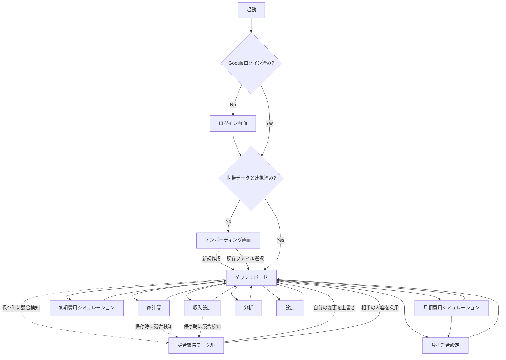

# 同棲家計シミュレーター 設計書 v1.0

要件定義 v1.0 ＋ アーキテクチャ決定事項（Google Drive連携によるデータ共有、Googleログインのみで認証、アクセス制限のみでの機密データ保護、競合検知＋警告）を反映した設計。

---

## 1. 画面一覧

| # | 画面名 | 概要 | 主な操作 |
|---|---|---|---|
| 1 | ログイン画面 | Googleアカウントでログイン（未ログイン時に表示） | Googleログイン |
| 2 | オンボーディング画面 | 初回利用時のみ表示。世帯データを新規作成するか、パートナーが共有した既存ファイルに参加するかを選択 | 新規作成 / 既存ファイル選択（Google Picker） |
| 3 | ダッシュボード | 世帯の収支・貯蓄状況を一覧表示するホーム画面 | グラフ確認、各画面への遷移 |
| 4 | 収入設定 | 自分・パートナーの収入情報を入力し、手取りを計算 | 入力・保存 |
| 5 | 初期費用シミュレーション | 同棲開始時の初期費用と入居可能時期を計算 | 入力・保存 |
| 6 | 月額費用シミュレーション | 月々の生活費カテゴリと予算を管理 | カテゴリ追加・編集・削除、予算入力 |
| 7 | 負担割合設定 | カテゴリごとの費用負担方法を設定 | 折半／収入比率／自由割合の設定 |
| 8 | 家計簿 | 実績の支出を記録・閲覧 | 追加・編集・削除、月別表示 |
| 9 | 分析 | 予測と実績を比較 | グラフ切替、期間切替 |
| 10 | 設定 | 連携状態・同期状況の確認、データの共有相手管理 | 再連携、ログアウト、エクスポート |
| 11 | 競合警告（モーダル） | 保存時にパートナーの更新と競合した場合に表示 | 自分の変更を上書き／相手の内容を採用 |

---

## 2. 画面遷移図



補足：
- 月額費用シミュレーションでカテゴリを追加・編集すると、対応する負担割合設定が未設定の状態になるため、その場で負担割合設定への遷移を促す（原要件の「家賃→収入比率」のような対応付けを忘れないようにするため）。
- 競合警告はどの画面からの保存でも共通のモーダルとして発生しうる。

---

## 3. データ設計

世帯データはGoogle Drive上の1つのJSONファイルとして保存し、自分・パートナー双方のアプリがこのファイルを読み書きする。以下が全体スキーマ。

```jsonc
{
  "meta": {
    "schemaVersion": 1,
    "householdId": "uuid",
    "createdAt": "ISO8601",
    "updatedAt": "ISO8601",       // 競合検知に使用
    "updatedBy": "self" | "partner"
  },

  "income": {
    "self": {
      "baseSalary": 0,           // 額面月給
      "bonusMonths": 0,          // ボーナス月数（年間）
      "housingAllowance": 0,     // 家賃補助
      "overtimeAvg": 0           // 残業代平均
    },
    "partner": { /* 同上の構造 */ },
    "calculated": {
      "selfMonthlyNet": 0,       // 推定手取り（月）
      "selfAnnualNet": 0,        // 推定手取り（年）
      "partnerMonthlyNet": 0,
      "partnerAnnualNet": 0,
      "householdNet": 0          // 世帯手取り
    }
  },

  "initialCost": {
    "items": {
      "rent": 0, "deposit": 0, "keyMoney": 0, "agencyFee": 0,
      "guaranteeFee": 0, "fireInsurance": 0, "keyExchange": 0,
      "support24h": 0, "movingCost": 0, "furnitureCost": 0, "other": 0
    },
    "totalCost": 0,              // 初期費用合計（算出値）
    "perPersonCost": 0,          // 一人当たり負担額（算出値）
    "targetSavings": 0,          // 目標貯蓄額
    "currentSavings": 0,         // 現在貯蓄額
    "savingsHistory": [
      { "date": "YYYY-MM", "amount": 0 }
    ],
    "moveInForecast": "YYYY-MM" // 入居可能時期予測（算出値）
  },

  "monthlyBudget": {
    "categories": [
      {
        "id": "rent",
        "name": "家賃",
        "budget": 0,
        "isDefault": true,        // 初期カテゴリは削除不可の制約に使用
        "order": 0
      }
      // electricity, gas, water, communication, food, dailyGoods,
      // insurance, subscription, social, other ... 同構造で続く
    ]
  },

  "costSharing": {
    "rules": [
      {
        "categoryId": "rent",
        "method": "incomeRatio",   // "half" | "incomeRatio" | "custom"
        "customRatio": null        // method=customのときのみ { "self": 70, "partner": 30 }
      }
    ]
  },

  "ledger": {
    "entries": [
      {
        "id": "uuid",
        "date": "YYYY-MM-DD",
        "amount": 0,
        "categoryId": "food",
        "payer": "self" | "partner",
        "memo": "",
        "createdAt": "ISO8601",
        "updatedAt": "ISO8601"
      }
    ]
  }
}
```

設計上の注意点（要件未確定部分の扱い）：
- `costSharing.method = "incomeRatio"` の比率は、保存せず**参照時に最新の収入設定から動的算出**する前提（収入が変わると過去の表示比率も変わる）。スナップショット固定にする場合はスキーマ変更が必要なため、実装前に確定すること。
- `monthlyBudget.categories` の `isDefault: true` は、原要件にあった初期カテゴリの削除可否の制約に使う想定（削除可否のルールは別途要決定）。
- 手取り計算（`income.calculated`）、`moveInForecast`、`perPersonCost` の算出ロジックは未確定のため、計算関数は別途仕様化が必要。

---

## 4. LocalStorage設計

LocalStorageは「Driveファイルへの紐付け情報」と「オフライン用キャッシュ」「個人のUI状態」のみを保持する。世帯データの正本はGoogle Drive側であり、LocalStorageはあくまで端末ローカルの補助領域という位置づけ。

| キー | 内容 | 備考 |
|---|---|---|
| `oto_drive_file_id` | 連携している世帯データファイルのID | オンボーディング完了時に保存 |
| `oto_household_cache` | 直近に同期した世帯データ全体（上記JSON） | 起動時オフラインでも表示できるようにするためのキャッシュ |
| `oto_last_synced_at` | 最終同期成功時刻 | 競合検知・キャッシュ鮮度表示に使用 |
| `oto_ui_state` | 表示中の月、選択中の分析グラフ種別など個人のUI設定 | 同期不要、端末固有 |
| `oto_role` | このブラウザの利用者が「self」か「partner」か | 家計簿の支払者初期値などに使用 |

Googleの認証トークンについて：
- アクセストークンは短命のため、LocalStorageには保存せずメモリ上（変数）で保持し、必要時にGoogle Identity Servicesでサイレント再認証する方式を推奨。リフレッシュトークンの永続保存は行わない。

機密データに関する注意：
- `oto_household_cache` には年収など機密データが平文で残る。要件レビューで「アクセス制限のみで暗号化なし」と決定済みのため想定どおりだが、共有端末で使う場合はブラウザのプロファイル分離を利用者側で行う必要がある旨をヘルプ等に記載することを推奨。

---

## 5. フォルダ構成

ビルドツールなしのバニラJS（ES Modules）＋ Tailwind CSS ＋ Chart.js、Netlifyでの静的配信を前提とした構成。

```
oto570/
├── index.html
├── netlify.toml
├── package.json                 # Tailwindビルド用のみ
├── tailwind.config.js
├── public/
│   └── favicon.svg
├── docs/
│   └── design_v1.0.md
└── src/
    ├── main.js                  # エントリーポイント、ルーター起動
    ├── router.js                # ハッシュベースの画面遷移管理
    │
    ├── auth/
    │   ├── googleAuth.js         # Google OAuthログイン処理
    │   └── onboarding.js         # 初回連携（新規作成／既存ファイル選択）
    │
    ├── drive/
    │   ├── driveClient.js         # Google Drive API呼び出し
    │   ├── sync.js                # 読み込み・保存・競合検知ロジック
    │   └── picker.js              # Google Picker起動
    │
    ├── store/
    │   ├── state.js                # メモリ上の世帯データストア
    │   ├── schema.js               # データ構造の初期値・マイグレーション
    │   └── localCache.js           # LocalStorage読み書き
    │
    ├── views/
    │   ├── login/
    │   ├── onboarding/
    │   ├── dashboard/
    │   ├── income/
    │   ├── initialCost/
    │   ├── monthlyBudget/
    │   ├── costSharing/
    │   ├── ledger/
    │   ├── analysis/
    │   └── settings/
    │       └── (各フォルダに *.html / *.js を配置)
    │
    ├── components/
    │   ├── chart/                  # Chart.jsラッパー（円・棒・折れ線）
    │   ├── modal/                  # 競合警告モーダル等
    │   └── forms/                  # 入力フォーム共通部品
    │
    ├── utils/
    │   ├── calc.js                  # 手取り計算・負担割合計算・分析用集計
    │   ├── format.js                 # 金額・日付フォーマット
    │   └── validators.js
    │
    └── styles/
        └── tailwind.css
```

---

## 未確定のまま残っているTBD項目（実装前に確定推奨）

- 手取り計算ロジック（額面→手取りの計算式）
- `costSharing` の収入比率を動的算出かスナップショット固定かにするか
- 初期費用の「一人当たり負担額」「入居可能時期予測」の算出式
- カテゴリ削除時の既存データ（家計簿・負担割合）への影響
- 自由割合の合計バリデーション（100%チェックの有無）
- 「節約額」「超過率」の計算式
- 分析画面の「光熱費」と月額カテゴリ（電気・ガス・水道）の対応関係
